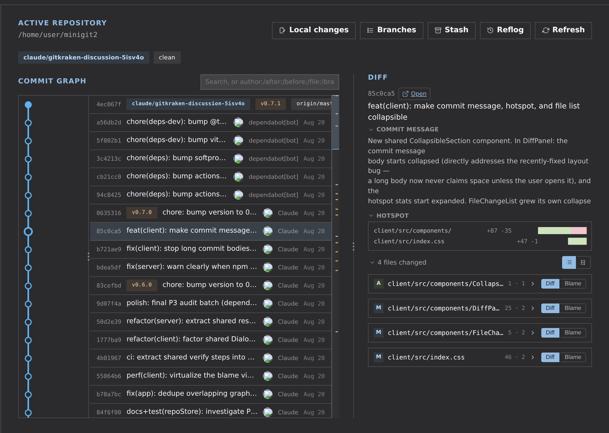
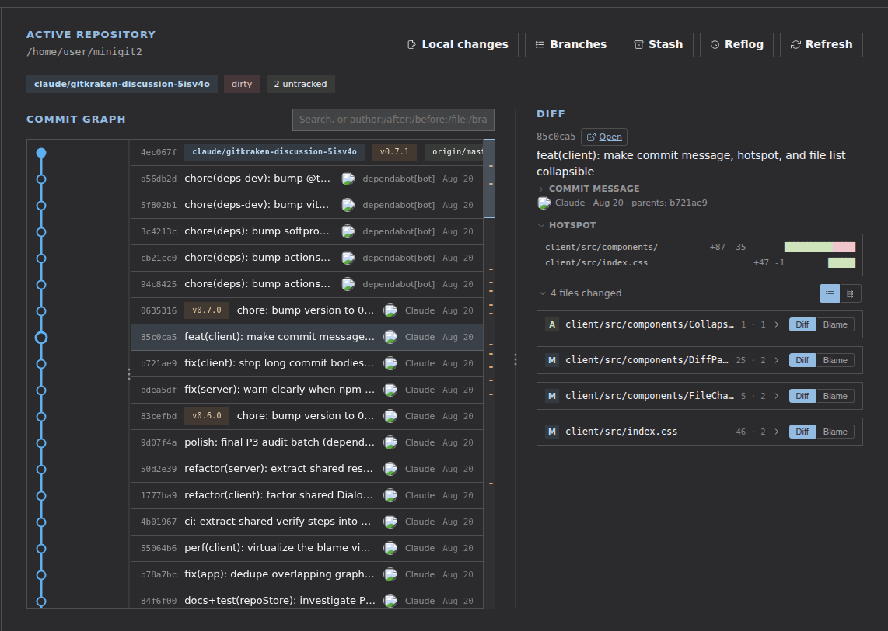
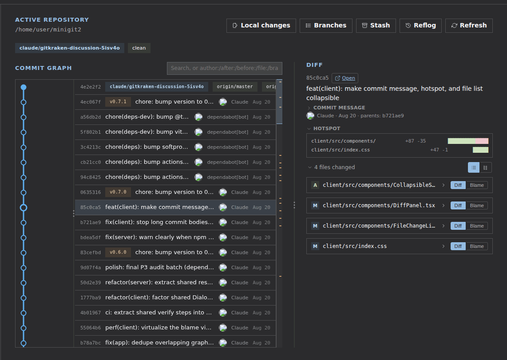

# minigit2

**A fast, local Git graph client for browsing history — click a commit, see
its diff, done.** No staging, no commit, no rebase: just the read side of
`git log --graph`, done properly, running as a real desktop window on your
own machine.

<p align="center">
  
</p>

## See it in action

<p align="center">
  
</p>

Click a commit → its diff panel opens. That's the whole interaction model.

<p align="center">
  
</p>

Inside a diff: open a file to read its patch, flip it to **blame** to see who
wrote each line, collapse the file list or commit message when you only need
one of them, and swap theme — all without leaving the panel.

## Why minigit2 over the git CLI

The CLI stays in charge of anything that changes history — this is a
companion for the part of your workflow that's just *looking*, not a
replacement for `git` itself.

- **The graph is drawn, not parsed.** `git log --graph` gives you ASCII art
  you decode line by line; minigit2 lays out branches, merges, and lanes as
  an actual graph you scan at a glance.
- **Click instead of remembering flags.** No more reaching for
  `git show <hash>`, `git diff a..b`, or `git log --follow -- path` — click a
  commit for its diff, click a file for its blame, Ctrl/Cmd-click a second
  commit to compare it against the first.
- **One search box.** `author:`, `file:`, `branch:`, `after:`/`before:` in a
  single query, matches highlighted in place — instead of chaining
  `--author`, `--`, and date-range flags by hand.
- **Read-only by construction.** There's no staging area, no commit button,
  no rebase UI — nothing in the app can rewrite history, so it's safe to
  hand to anyone browsing a repo, including people who don't know git well
  enough to be trusted with it yet.
- **Multi-repo from one sidebar.** Switch between repos by clicking a card
  instead of `cd`-ing between terminal tabs.
- **A real window, not a browser tab.** Ships as a local desktop app (see
  [Install](#install)) — no address bar, no tab clutter, nothing to expose
  beyond `127.0.0.1`. And it's free and open source.

## Features

- **Multi-repo**: add a repo by absolute path or via a built-in folder
  browser, switch between added repos.
- **Commit graph**: local branches, tags, and remote-tracking branches
  (`origin/*`), with ref badges (including HEAD, detached or not). The
  checked-out branch's lane is drawn in a more saturated color so it stands
  out from the rest of the history. Virtualized list: only visible rows are
  mounted, scales to large histories.
- **Per-commit diff**: click a commit to see its changed files; each file
  expands and loads its patch on demand. Resizable panel (drag the
  divider).
- **Checkout**: double-click a commit for a detached checkout, or a branch
  badge to check out that branch (checking out a remote badge creates/reuses
  a local tracking branch instead of detaching, matching `git checkout
  <name>`'s own DWIM behavior). Confirms if the working tree has uncommitted
  changes; `git`'s own refusal remains the final safety net (no
  force/discard).
- **Branches**: local vs. remote-tracking branches listed separately, with
  the repo's default branch marked (resolved from `origin/HEAD`).
- **Status**: bar showing current branch / detached HEAD / working tree
  dirty state, ahead/behind counts vs the tracked upstream, manual refresh
  button plus automatic refresh every 30s (new commits found in the
  background surface as a dismissible banner instead of silently
  replacing the list).
- **Compare**: Ctrl/Cmd-click a second commit to diff it against the first
  selected one (not just parent vs child).
- **Keyboard**: Up/Down to move the graph selection, Enter to check it out.
  Click a hash or file path to copy it.
- **Search**: filter the graph by commit message, author, or hash — matches
  highlight in place (no re-fetch, stays fast on large histories), Enter/↑↓
  jump the selection between matches.
- **Design**: reskinned on the Industry design system (blueprint/wireframe
  aesthetic, qualitative lane palette), with a light/dark theme toggle
  persisted per browser. Sidebar repo cards show each repo's own branch and
  dirty state at a glance.
- **Local changes, stash, reflog**: view the working tree's uncommitted diff
  (staged, unstaged, and untracked files) in the same diff panel used for
  commits; read-only lists of stashed changes and the reflog, each with
  copyable hashes. Click a stash entry to expand its own file diff.
- **Error toasts**: any failed git command on the server surfaces as a
  dismissible toast, in addition to whatever inline state it also updates —
  errors from background refreshes are no longer silent.

> This list is updated as major features land, not for implementation
> details — see the Git history for that.

Architecture and technical decisions: [docs/PLAN.md](docs/PLAN.md). Known
issues, tech debt, and perf/test-coverage gaps not yet addressed:
[docs/AUDIT.md](docs/AUDIT.md).

## Install

On Ubuntu or Windows, download the AppImage or installer from the
[Releases page](https://github.com/saajuck/minigit2/releases) — it opens as a normal desktop
window, no browser tab required. macOS and other Linux distros run from source. See
[docs/DEPLOY.md](docs/DEPLOY.md) for details.

## Development

```bash
npm install
npm run dev
```

## Build / run

```bash
npm run build
npm start
```

The server only listens on `127.0.0.1` — no authentication, never expose it
on the network.
